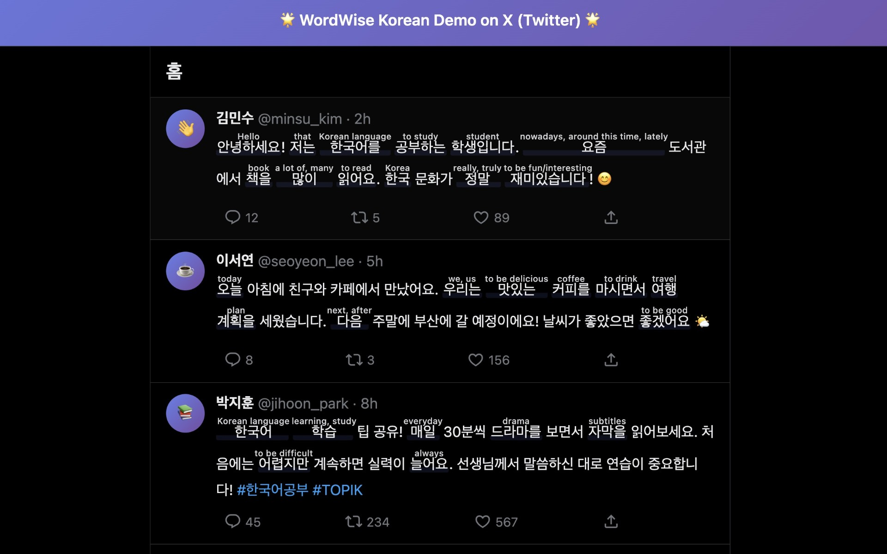

# WordWise Korean 📚

A browser extension that adds Kindle Word Wise style annotations for Korean language learning. Translations appear directly above vocabulary words - always visible, no hover needed!

## ✨ Features

- **Instant Translations**: Korean vocabulary words are automatically annotated with translations above them
- **TOPIK Levels**: Filter vocabulary by TOPIK I, TOPIK Ⅱ, or all levels (**6,065 words**)
- **English Translations**: High-quality English translations (Chinese & Japanese coming soon!)
- **Smart Matching**: POS-aware two-pass lookup handles verb/adjective conjugations and correctly resolves noun/verb ambiguity (살/살다, 배우/배우다, 서/서다, 해요/하다)
- **Clean Translations**: Parenthetical notes, tilde meta-descriptions, and near-synonyms automatically stripped for concise display
- **Grammar Particle Filtering**: Excludes common particles (은/는/이/가/을/를/etc.) to avoid cluttering text
- **Dynamic Content**: Works on single-page applications with real-time updates
- **Visual Highlight**: Optional background highlight for annotated words
- **Privacy First**: All processing happens locally - no data sent to servers

## 🎯 How It Works

When you visit a Korean website, the extension:

1. Scans the page for Korean text
2. Matches words against your vocabulary level
3. Adds ruby tags with translations above words
4. Watches for new content and annotates it automatically

Example:
```
Hello     friend     library
안녕하세요! 친구와 함께 도서관에 갔어요.
```



## 🚀 Installation

### For Users

**Download the extension:**

1. Get the latest ZIP from [GitHub Releases](https://github.com/leahyums/wordwise_korean/releases/latest)
2. Open Chrome and go to `chrome://extensions/`
3. Enable **Developer mode** (toggle in top right)
4. Drag and drop the ZIP directly onto the page
5. Click the extension icon and enable it!

### For Developers

1. **Install dependencies**:
```bash
pnpm install
# or npm install / yarn install
```

2. **Start development mode**:
```bash
pnpm dev
```

This will:
- Build the extension
- Open Chrome with the extension loaded
- Watch for changes and auto-reload

3. **Visit a Korean website** to test:
- https://ko.wikipedia.org
- https://news.naver.com
- https://twitter.com (search for Korean content)

### Building for Production

```bash
# Build for Chrome/Edge
pnpm build

# Build for Firefox
pnpm build:firefox

# Create distribution ZIP
pnpm zip
```

Output will be in `.output/` directory.

## 📖 Usage

1. Click the extension icon in your browser toolbar
2. Enable the extension using the toggle
3. Select your vocabulary level:
   - **TOPIK I**: Basic vocabulary (1,578 words)
   - **TOPIK Ⅱ**: Intermediate/Advanced (4,487 words)
   - **All**: Complete vocabulary (6,065 words)
4. Adjust settings like translation size and highlighting
5. Visit any Korean website and see translations appear!

## 🏗️ Project Structure

```
wordwise_korean/
├── src/
│   ├── entrypoints/
│   │   ├── content.ts           # Main annotation logic
│   │   ├── background.ts        # Background script
│   │   └── popup/              # Settings UI
│   ├── utils/
│   │   ├── annotator.ts        # Core annotation engine
│   │   ├── vocabulary-loader.ts # Vocab filtering
│   │   ├── korean-stem.ts      # Conjugation matching
│   │   └── dom-observer.ts     # Dynamic content watcher
│   ├── assets/
│   │   └── topik-vocab.json    # 6,065 words from TOPIK I + II (deduplicated)
│   ├── tests/
│   │   ├── vocab-translations.test.ts  # Translation precision tests
│   │   └── stem-matching.test.ts        # Conjugation matching tests
│   └── types/
│       └── index.ts            # TypeScript interfaces
├── scripts/
│   ├── pdf-to-vocab.js         # Parse PDF text to JSON
│   ├── csv-to-vocab.js         # Convert CSV to vocab JSON
│   ├── batch-translate.js      # AI translation tool
│   └── README.md               # Scripts documentation
├── data/
│   ├── README.md               # Vocabulary customization guide
│   ├── topik-1671-words.txt    # TOPIK I source text
│   └── topik-2662-words.txt    # TOPIK II source text
├── public/                     # Static assets
├── vitest.config.ts           # Test configuration
├── wxt.config.ts              # WXT configuration
└── package.json
```

## 🛠️ Tech Stack

- **Framework**: [WXT](https://wxt.dev/) - Modern extension development
- **UI**: Vue 3 + TypeScript
- **Styling**: Native CSS with ruby tag support
- **Build**: Vite
- **Manifest**: V3 (Chrome/Edge/Firefox compatible)

## 🐛 Troubleshooting

### Extension not working?

1. Check if extension is enabled in popup
2. Refresh the page after changing settings
3. Check browser console for errors (F12 → Console)

### Annotations not appearing?

- Make sure the page contains Korean text (Hangul characters)
- Verify vocabulary level includes the words
- Check if the site is using unsupported elements (SVG, Canvas)

### Performance issues?

- Reduce vocabulary level to decrease processing
- The extension uses debouncing (500ms) for dynamic content
- Some sites with heavy dynamic updates may experience slight delays

## 📝 Development Tips

### Hot Reload
WXT provides instant hot reload - just save your changes and see them immediately!

### Running Tests
```bash
pnpm test          # Run all 109 tests
pnpm test:watch    # Watch mode during development
```

Tests cover translation precision, vocabulary data integrity, Korean stem matching, and POS-aware collision resolution.

### Testing on Live Sites
Test on these Korean websites:
- https://ko.wikipedia.org/wiki/한국어
- https://news.naver.com
- https://twitter.com/search?q=한국어

### Debugging
- Open extension popup and check console: Right-click → Inspect
- Content script logs: Open page console (F12)
- Background script: `chrome://extensions` → Details → Inspect views

## 🤝 Contributing

Contributions welcome! Please:

1. Fork the repository
2. Create a feature branch (`git checkout -b feature/amazing-feature`)
3. Commit your changes (`git commit -m 'Add amazing feature'`)
4. Push to the branch (`git push origin feature/amazing-feature`)
5. Open a Pull Request

### Adding Vocabulary

Want to expand or customize the vocabulary? See [data/README.md](data/README.md) for:
- How to add words from CSV or PDF files
- Batch translation guide
- Styling customization
- Quality control checklist

Priority areas:
- Add Chinese and Japanese translation support
- Expand vocabulary coverage within existing levels

## 📄 License

MIT License - feel free to use this project for learning and development!

## 🙏 Acknowledgments

- Inspired by [Furigana Maker](https://github.com/aiktb/furiganamaker) for Japanese learning
- Built with [WXT](https://wxt.dev/) - amazing extension framework
- Korean vocabulary based on TOPIK standards

## 🎯 Roadmap

- [x] Expand vocabulary to TOPIK I + II (now 6,065 words)
- [x] Handle Korean verb/adjective conjugations
- [x] Filter common grammar particles
- [x] Translation quality pass (concise, no verbose prefixes, synonym dedup, tilde-description stripping)
- [x] Fix stem-matching collisions (살/살다, 배우/배우다, 서/서다, 해요/하다) — POS-aware two-pass lookup
- [x] Fix digit-compound annotation (1심, 2층, etc.)
- [x] Automated test suite (109 tests)
- [ ] Add Chinese and Japanese translation support
- [ ] Add user custom vocabulary
- [ ] Statistics dashboard (words learned, pages visited)
- [ ] Export/import vocabulary lists
- [ ] Pronunciation audio support
- [ ] Spaced repetition learning features

---

Made with ❤️ for Korean language learners

**Start learning Korean vocabulary while browsing the web! 화이팅! 💪**
