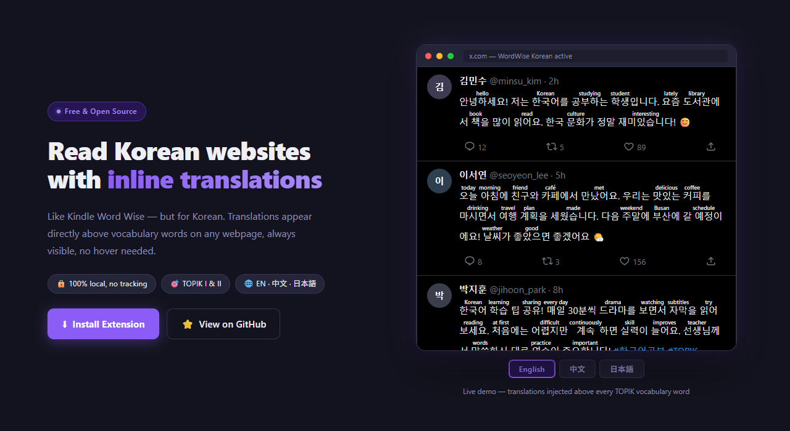

# WordWise Korean 📚

A browser extension that adds Kindle Word Wise style annotations for Korean language learning. Translations appear directly above vocabulary words - always visible, no hover needed!

🌐 **[Live Demo & Landing Page](https://multilingual-lab.github.io/wordwise_korean/)**





## ✨ Features

- **6,064 TOPIK words** — Level I (beginner), II (intermediate), or all
- **3 languages** — English, 中文, 日本語
- **Always-visible** — translations float above words, no hover required
- **Smart matching** — handles conjugated verbs and adjective forms
- **100% local** — no data sent, works on any Korean site

## 🚀 Installation

1. Get the latest ZIP from [GitHub Releases](https://github.com/multilingual-lab/wordwise_korean/releases/latest)
2. Open Chrome and go to `chrome://extensions/`
3. Enable **Developer mode** (toggle in top right)
4. Drag and drop the ZIP directly onto the page
5. Click the extension icon and enable it!

## 📖 Usage

1. Click the extension icon in your browser toolbar
2. Enable the extension using the toggle
3. Select your vocabulary level:
   - **TOPIK I**: Basic vocabulary
   - **TOPIK II**: Intermediate/Advanced
   - **All**: Complete vocabulary
4. Select your translation language: **English**, **Chinese**, or **Japanese**
5. Adjust settings like translation size and highlighting
6. Visit any Korean website and see translations appear!

## 🔧 For Developers

### Setup

1. **Install dependencies**:
```bash
pnpm install
# or npm install / yarn install
```

2. **Start development mode**:
```bash
pnpm dev
```

This will:
- Build the extension
- Open Chrome with the extension loaded
- Watch for changes and auto-reload

### Running Tests
```bash
pnpm test          # Run all tests
pnpm test:watch    # Watch mode during development
```

Tests cover translation precision, vocabulary data integrity, Korean stem matching, and POS-aware collision resolution.

### Debugging
- Open extension popup and check console: Right-click → Inspect
- Content script logs: Open page console (F12)
- Background script: `chrome://extensions` → Details → Inspect views

Test on live Korean sites:
- https://ko.wikipedia.org/wiki/한국어
- https://news.naver.com
- https://twitter.com/search?q=한국어

### Building for Production

```bash
# Build for Chrome/Edge
pnpm build

# Build for Firefox
pnpm build:firefox

# Create distribution ZIP
pnpm zip
```

Output will be in `.output/` directory.

## ️ Tech Stack

- **Framework**: [WXT](https://wxt.dev/) - Modern extension development
- **UI**: Vue 3 + TypeScript
- **Styling**: Native CSS with ruby tag support
- **Build**: Vite
- **Manifest**: V3 (Chrome/Edge/Firefox compatible)

## 🐛 Troubleshooting

### Extension not working?

1. Check if extension is enabled in popup
2. Refresh the page after changing settings
3. Check browser console for errors (F12 → Console)

### Annotations not appearing?

- Make sure the page contains Korean text (Hangul characters)
- Verify vocabulary level includes the words
- Check if the site is using unsupported elements (SVG, Canvas)

### Performance issues?

- Reduce vocabulary level to decrease processing
- The extension uses debouncing (500ms) for dynamic content
- Some sites with heavy dynamic updates may experience slight delays

## 🗺️ Roadmap

- [x] Expand vocabulary to TOPIK I + II
- [x] Handle Korean verb/adjective conjugations
- [x] Filter common grammar particles
- [x] Translation quality pass (concise, no verbose prefixes, synonym dedup, tilde-description stripping)
- [x] Fix stem-matching collisions (살/살다, 배우/배우다, 서/서다, 해요/하다) — POS-aware two-pass lookup
- [x] Fix digit-compound annotation (1심, 2층, etc.)
- [x] Add Chinese and Japanese translations via Azure OpenAI batch translation
- [ ] Add more vocabulary

## 🤝 Contributing

Contributions welcome! Please:

1. Fork the repository
2. Create a feature branch (`git checkout -b feature/amazing-feature`)
3. Commit your changes (`git commit -m 'Add amazing feature'`)
4. Push to the branch (`git push origin feature/amazing-feature`)
5. Open a Pull Request

### Adding Vocabulary

Want to expand or customize the vocabulary? See [data/README.md](data/README.md) for:
- Original vocabulary sources
- How to re-scrape and merge new words
- Batch translation guide (Azure OpenAI)
- Quality control checklist

## 📄 License

MIT License - feel free to use this project for learning and development!

## 🙏 Acknowledgments

- Inspired by [Furigana Maker](https://github.com/aiktb/furiganamaker) for Japanese learning
- Built with [WXT](https://wxt.dev/) - amazing extension framework
- Korean vocabulary based on TOPIK standards

---

Made with ❤️ for Korean language learners

**Start learning Korean vocabulary while browsing the web! 화이팅! 💪**
